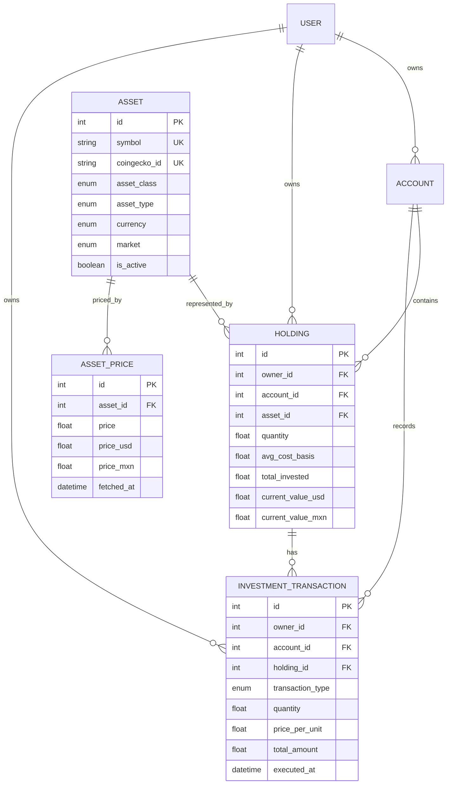
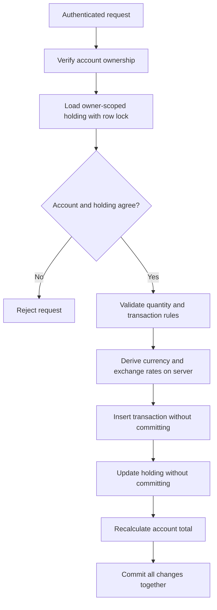
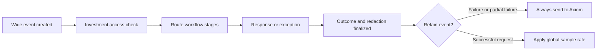

# Investments System Structure

## Purpose

This document describes the complete investments subsystem: its architecture, data
model, API surface, workflows, security boundaries, pricing integrations, invariants,
and current limitations. It is intended for backend developers, frontend developers,
reviewers, and maintainers working on portfolio functionality.

The investments API is mounted at:

```text
/api/v1/investments
```

All routes require authentication. User-facing routes require an active user, while
global catalog mutations require superuser privileges. Unless explicitly marked as
global or superuser-only, portfolio data is scoped to the current user.

## System Map

```text
backend/app/app/
├── api/api_v1/endpoints/
│   ├── investments.py                 Router composition
│   ├── assets.py                      Asset catalog, search, and prices
│   ├── holdings.py                    User positions
│   ├── investment_transactions.py     Investment ledger
│   └── portfolio.py                   Portfolio aggregation
├── models/
│   ├── asset.py
│   ├── asset_price.py
│   ├── holding.py
│   ├── investment_transaction.py
│   └── account.py
├── schemas/
│   ├── asset.py
│   ├── asset_price.py
│   ├── holding.py
│   ├── investment_transaction.py
│   └── portfolio.py
├── crud/
│   ├── crud_asset.py
│   ├── crud_asset_price.py
│   ├── crud_holding.py
│   ├── crud_investment_transaction.py
│   └── crud_account.py
└── services/
    ├── asset_resolver.py
    ├── price_fetcher.py
    ├── yahoo_finance.py
    ├── coingecko.py
    └── currency_converter.py
```

The main router composes four subrouters:

```text
/assets
/holdings
/transactions
/portfolio
```

## Domain Model

### Relationship overview



### Asset

An asset is a globally shared financial instrument. It is not owned by an individual
user. Multiple users can hold the same asset, and a price refresh for that asset can
update valuations across all related holdings.

Important fields:

| Field | Meaning |
|---|---|
| `symbol` | Globally unique normalized symbol |
| `name` | Display name |
| `asset_class` | Broad allocation category |
| `asset_type` | Specific instrument type |
| `currency` | Native quotation currency |
| `market` | Trading venue or market category |
| `coingecko_id` | Unique CoinGecko identity for crypto assets |
| `is_active` | Whether the asset remains available for normal use |

Direct creation, modification, and deactivation of assets are superuser-only because
the records are global. Normal users can cause a verified asset to be created through
the holding or transaction-with-asset workflows.

### Holding

A holding represents one user's position in one asset inside one account.

The database allows only one holding for a given `(account_id, asset_id)` pair. A user
who owns the account is also assigned as the holding owner.

Important field groups:

- Position: `quantity`, `avg_cost_basis`, `cost_currency`, `total_invested`.
- Current valuation: `current_value`, `current_value_usd`, `current_value_mxn`.
- Performance: `unrealized_gain_loss`, `unrealized_gain_loss_pct`.
- Ownership: `owner_id`, `account_id`, `asset_id`.

Valuation and performance fields are server-owned. Clients may directly edit only
quantity, average cost basis, and cost currency. Transaction endpoints should be used
for ordinary buy, sell, transfer, split, and dividend activity so the ledger remains
meaningful.

Deleting a holding also deletes its associated investment transactions through the
ORM cascade. This operation is permanent and should be treated as deleting the complete
position history for that account and asset.

### Investment transaction

An investment transaction is the historical ledger entry associated with a holding.

Supported transaction types:

| Type | Effect on holding |
|---|---|
| `buy` | Increases quantity and recalculates average cost basis |
| `sell` | Decreases quantity and proportionally removes invested cost |
| `dividend` | Creates history but does not change quantity or cost basis |
| `split` | Multiplies quantity while retaining total invested cost |
| `transfer_in` | Increases quantity and invested cost |
| `transfer_out` | Decreases quantity and proportionally removes invested cost |

`total_amount` is calculated as `quantity × price_per_unit`. Fees are stored separately
and are currently not added to `total_amount` or cost basis.

Transactions are immutable through the API. The delete route verifies ownership and
then returns `409 Conflict`. Corrections should be represented by a new compensating
transaction. This prevents a deleted ledger row from silently leaving the holding's
quantity and cost basis in an inconsistent state.

### Asset price

Asset prices are append-only cached observations. Each record stores:

- Native price and currency.
- Converted USD and MXN prices.
- Optional open, high, low, previous-close, volume, and change data.
- The upstream fetch timestamp.

The latest observation is used to value holdings. Price refreshes update every holding
that references the asset and then recalculate totals for the affected accounts.

### Account

Holdings and transactions belong to an existing account. The account must belong to
the current user before an investment mutation is permitted.

The account includes a cached `total_investments` field. It is recalculated from its
holdings after relevant changes. See the limitations section for mixed-currency
considerations.

## Enumerations

### Asset classes

| Value | Purpose |
|---|---|
| `equities` | Stock-based investments |
| `fixed_income` | Bonds, CETES, and treasury instruments |
| `crypto` | Cryptocurrencies |
| `funds` | ETFs, mutual funds, and index funds |

### Asset types

| Value | Inferred class |
|---|---|
| `stock` | `equities` |
| `etf` | `equities` |
| `bond` | `fixed_income` |
| `cetes` | `fixed_income` |
| `treasury` | `fixed_income` |
| `cryptocurrency` | `crypto` |
| `mutual_fund` | `funds` |
| `index_fund` | `funds` |

The application normally infers `asset_class` from `asset_type`.

### Currencies

- `USD`
- `MXN`

### Markets

- `NYSE`
- `NASDAQ`
- `BMV`
- `CRYPTO`
- `OTC`

## API Surface

### Assets

| Method | Path | Access | Purpose |
|---|---|---|---|
| `GET` | `/assets` | Active user | List and filter global assets |
| `POST` | `/assets` | Superuser | Create a global asset |
| `GET` | `/assets/search` | Active user | Search the local asset catalog |
| `GET` | `/assets/search-external` | Active user | Search Yahoo Finance stocks and ETFs |
| `GET` | `/assets/search-crypto` | Active user | Search CoinGecko assets |
| `GET` | `/assets/{asset_id}` | Active user | Read an asset and its latest price |
| `PUT` | `/assets/{asset_id}` | Superuser | Modify a global asset |
| `DELETE` | `/assets/{asset_id}` | Superuser | Soft-deactivate a global asset |
| `GET` | `/assets/{asset_id}/price` | Active user | Read price; holders or superusers may refresh |
| `POST` | `/assets/refresh-prices` | Active user | Refresh assets in the user's holdings |

Setting `only_my_holdings=false` on bulk price refresh is superuser-only.
Single-asset refresh is restricted to users who hold the asset and superusers. Other
authenticated users can read cached global prices without causing upstream work.

### Holdings

| Method | Path | Purpose |
|---|---|---|
| `GET` | `/holdings` | List current user's holdings |
| `POST` | `/holdings` | Create a position from an asset ID or verified external ID |
| `GET` | `/holdings/{holding_id}` | Read an owned holding |
| `PUT` | `/holdings/{holding_id}` | Edit allowed position fields |
| `DELETE` | `/holdings/{holding_id}` | Delete a holding and its transaction history |

Holdings can be filtered by account, asset class, and asset currency.

### Transactions

| Method | Path | Purpose |
|---|---|---|
| `GET` | `/transactions` | List current user's transactions |
| `POST` | `/transactions` | Record a transaction against an existing holding |
| `POST` | `/transactions/with-asset` | Resolve/create an asset and holding, then transact |
| `GET` | `/transactions/{transaction_id}` | Read an owned transaction |
| `DELETE` | `/transactions/{transaction_id}` | Returns `409`; ledger entries are immutable |

Transaction lists can be filtered by holding, account, or transaction type. If several
filters are supplied, the current endpoint prioritizes holding, then account, then type.

### Portfolio analytics

| Method | Path | Result |
|---|---|---|
| `GET` | `/portfolio/summary` | Total value, invested cost, gain/loss, and counts |
| `GET` | `/portfolio/allocation/by-class` | Allocation by broad asset class |
| `GET` | `/portfolio/allocation/by-currency` | USD versus MXN exposure |
| `GET` | `/portfolio/allocation/by-market` | Allocation by market |
| `GET` | `/portfolio/allocation/by-type` | Allocation by instrument type |
| `GET` | `/portfolio/allocation/by-country` | Geographic allocation |
| `GET` | `/portfolio/allocation/by-account` | Allocation by owned account |
| `GET` | `/portfolio/top-holdings` | Largest positions by USD value |

Portfolio analytics operate only on holdings owned by the current user.

## Core Workflows

### Create a holding from a known asset

```text
Client submits account_id + asset_id + initial position
  → validate account ownership
  → load global asset
  → verify no holding exists for account + asset
  → calculate total_invested and initial valuation
  → create holding with current user as owner
  → recalculate account investment total
```

### Resolve an external asset

```text
Client submits provider + external_id
  → query fixed upstream provider
  → require an exact upstream identity match
  → validate supported exchange and instrument type
  → normalize symbol, market, currency, and country
  → match existing global asset by provider identity or symbol
  → reject conflicting global identities
  → create global asset if no valid match exists
```

Yahoo resolution accepts supported US and Mexican stocks and ETFs. CoinGecko resolution
uses the CoinGecko asset ID, not only the ticker symbol, because crypto symbols are not
globally unique.

### Record a position-changing transaction



The row lock serializes concurrent mutations to the same holding. Two simultaneous sell
requests cannot both validate against the same pre-sale quantity and create a negative
position.

### Refresh prices

```text
Select asset or assets
  → fetch price from Yahoo Finance or CoinGecko
  → obtain USD/MXN conversion where needed
  → store a new AssetPrice observation
  → update all holdings for the asset
  → recalculate every affected account total
```

Fixed-income and some fund assets require manual pricing because the automatic fetcher
currently handles equities and crypto only.

## Validation and Security Invariants

### Ownership

- Account ownership is checked before holding or transaction creation.
- Holding and transaction queries are scoped by `owner_id` where applicable.
- A transaction's account must match its holding's account.
- Superusers can inspect or maintain selected global and user records.

### Server-owned financial data

Clients cannot directly set holding valuation, gain/loss, ownership, timestamps, or
derived total fields through the holding update schema. Transaction currency and exchange
rates are derived by the server even if a client attempts to supply alternatives.

### Numeric validation

- Quantities must be finite and positive for transactions.
- Holding quantities and cost values must be finite and non-negative.
- Prices and fees cannot be negative.
- Exchange rates must be finite and greater than zero.
- Quantities, prices, and fees are capped at `1e15`; derived totals are capped at `1e30`
  to prevent floating-point overflow and non-serializable responses.
- Database check constraints provide a second validation layer.

### Identity and uniqueness

- Asset symbols are globally unique.
- CoinGecko IDs are globally unique when present.
- An account cannot have two holdings for the same asset.
- External asset metadata must not conflict with an existing global identity.

### Atomicity and concurrency

- Position-changing transaction writes use a database row lock.
- The ledger insert, holding update, and account recalculation share one commit.
- Invalid sells and transfers are rejected before inserting a ledger row.
- Uniqueness races return `409 Conflict` rather than an unhandled database error.

### Request and upstream abuse controls

- Collection limits are bounded to a maximum of 100 where exposed by the investments
  endpoints.
- External search input is limited to 100 characters; external asset IDs are limited to
  128 characters.
- Top holdings is limited to 50 results.
- External searches and asset resolution have short per-user throttling intervals.
- Single-asset refreshes are throttled by shared asset ID, preventing different users
  from bypassing the same refresh guard.
- Upstream HTTP clients use bounded timeouts and do not follow redirects.
- Blocking Yahoo Finance operations are moved off the async event loop.

The current throttle is in process memory. It protects an individual application worker
but is not a distributed rate limiter across multiple workers or replicas.

## External Services

### Yahoo Finance

Used for:

- Stock and ETF discovery.
- Equity price retrieval.
- USD/MXN exchange-rate retrieval.

Mexican tickers use Yahoo's `.MX` suffix externally. The suffix is removed from the
internal normalized symbol and the market is stored as `BMV`.

### CoinGecko

Used for:

- Cryptocurrency discovery.
- Crypto price retrieval in USD and MXN.

The persistent `coingecko_id` is the authoritative crypto identity. Ticker symbols alone
must not be assumed unique.

### Currency conversion

USD/MXN rates are cached in process for 15 minutes. If Yahoo fails, the converter returns
the most recently cached rate when available; otherwise it currently falls back to `17.0`.
This fallback keeps requests available but should be considered approximate financial
data.

## Database Integrity

The investments tables use foreign keys linking users, accounts, holdings, assets, and
transactions. Additional constraints enforce:

- Unique `(account_id, asset_id)` holdings.
- Unique CoinGecko identities.
- Non-negative holding quantities and costs.
- Positive transaction quantities.
- Non-negative transaction prices and fees.
- Positive exchange rates when present.

The relevant hardening migration is:

```text
backend/app/alembic/versions/6f45d8c2a901_harden_investment_integrity.py
```

Before applying it to an existing database, check for duplicate holdings, duplicate
CoinGecko IDs, and legacy negative values. Constraint creation will fail if incompatible
data already exists; the migration intentionally does not delete or rewrite financial
records automatically.

## Axiom Observability

The investments subsystem uses the application's existing one-wide-event-per-request
pipeline. The investments router initializes an `investment` context during the feature
access check, and each handler adds identifiers and workflow stages as work completes.
The middleware finalizes and emits the event after the response status is known.



Stable operation names cover all assets, prices, holdings, transactions, and portfolio
routes. Critical workflows additionally identify stages such as `ownership_check`,
`provider_lookup`, `asset_resolution`, `fx_lookup`, `row_lock`,
`transaction_validation`, `ledger_write`, `holding_update`, `aggregation`, and `commit`.
A failed event therefore shows both the last stage entered and the stages completed
before it.

HTTP `4xx` and `5xx` responses have request-level `outcome = "error"` and investment-level
`outcome = "failure"`, so they bypass success sampling. Expected domain branches provide
stable reason codes where possible; validation or dependency failures fall back to an
`http_<status>` reason. A bulk refresh with failed assets uses `partial_failure` even
though its public API response remains HTTP `200`, and is explicitly retained.

Investment telemetry is metadata-only. It may contain internal user, account, asset,
holding, and transaction IDs; symbols; providers; transaction types; counts; booleans;
stages; and timings. It does not contain quantities, prices, fees, portfolio totals,
notes, names, email addresses, credentials, request bodies, or raw search text. Query
strings and unexpected exception messages are redacted before ingestion.

The complete field reference, investigation procedure, and APL query recipes are in
`AXIOM_README.md`.

## Error Behavior

Common responses include:

| Status | Meaning |
|---|---|
| `400` | Invalid position rule, such as selling more than available |
| `403` | Authenticated user does not own the referenced record or lacks privileges |
| `404` | Referenced account, asset, holding, or transaction was not found |
| `409` | Identity/uniqueness conflict or attempted transaction deletion |
| `422` | Schema validation failure or unsupported external asset |
| `429` | External lookup or refresh was requested too frequently |

## Testing Structure

Investment tests are part of the live backend suite:

```text
backend/app/tests/
├── api/
│   ├── test_investment_assets.py
│   ├── test_investment_holdings.py
│   ├── test_investment_transactions.py
│   ├── test_investment_portfolio.py
│   ├── test_investment_security.py
│   └── test_investment_telemetry.py
├── crud/
│   ├── test_crud_asset.py
│   ├── test_crud_asset_price.py
│   ├── test_crud_holding.py
│   └── test_crud_investment_transaction.py
└── business_logic/
    ├── test_investment_position_math.py
    └── test_investment_valuation_flow.py
```

Coverage includes:

- Blocking normal users from mutating global assets.
- Pagination and external-query bounds.
- Rejection of client-owned valuation fields.
- Rejection of unsafe transaction amounts and derived fields.
- The 28-route investment operation inventory.
- Telemetry merging, workflow stages, results, and normalized failures.
- Error retention, success sampling, and forced retention of partial refreshes.
- Redaction of search text, monetary data, notes, and exception parameters.
- Atomic rollback and representative investment workflow outcomes.

The suite uses the `enable_investments` fixture to enable the feature gate, allowlist the
test user, provide a deterministic USD/MXN rate, and neutralize endpoint-local Redis rate
limiting. External provider and price fetches are patched at their service boundaries.
All database-facing cases run against the isolated PostgreSQL test container and roll
back through a per-test savepoint.

Tests use a fixture that drops and recreates its configured database. Always point the
suite at an isolated test database, never a development or production database.

## Current Limitations and Design Considerations

1. Financial values use floating-point columns and Python `float`. Exact financial
   accounting would be safer with fixed-precision `NUMERIC`/`Decimal` values and explicit
   rounding rules.
2. `Account.total_investments` sums `Holding.current_value`, which is the native valuation
   field. Accounts containing mixed native currencies need an explicit base-currency
   policy to make this cached total meaningful.
3. Direct holding edits recalculate the position but do not create ledger entries. Use
   transaction routes when auditable history matters.
4. Transaction fees are stored but are not currently included in cost basis.
5. Transaction history cannot be edited or deleted. A dedicated correction/reversal
   workflow could provide stronger semantics than manually choosing an opposite action.
6. Price history is stored, but there is no implemented portfolio-performance-over-time
   route despite performance schema classes existing in the codebase.
7. External throttling and exchange-rate caches are local to each process. Distributed
   deployments should use a shared rate limiter and cache.
8. Asset symbols are globally unique across all markets. Instruments with the same symbol
   on different markets cannot currently coexist unless the identity model is expanded.
9. The exchange-rate fallback favors availability over strict valuation accuracy.

## Extension Guidelines

When adding a new investment capability:

1. Define whether the data is global, account-owned, or user-owned.
2. Add ownership filtering in the data-access query, not only after loading a record.
3. Separate client-editable input schemas from server-owned response and derived fields.
4. Validate financial rules before inserting ledger records.
5. Keep related ledger, holding, and account changes in one database transaction.
6. Lock positions when concurrent requests could overspend or overwrite state.
7. Add database constraints for invariants that must hold outside the API process.
8. Use stable provider identities instead of display symbols where possible.
9. Bound queries and upstream calls, and use explicit timeouts.
10. Add regression tests for cross-user access, invalid financial states, concurrency,
    rollback, and migration compatibility.
